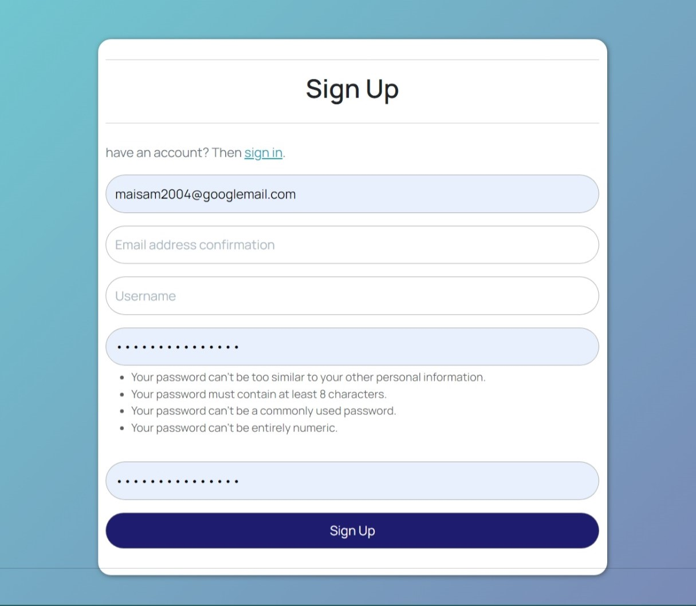
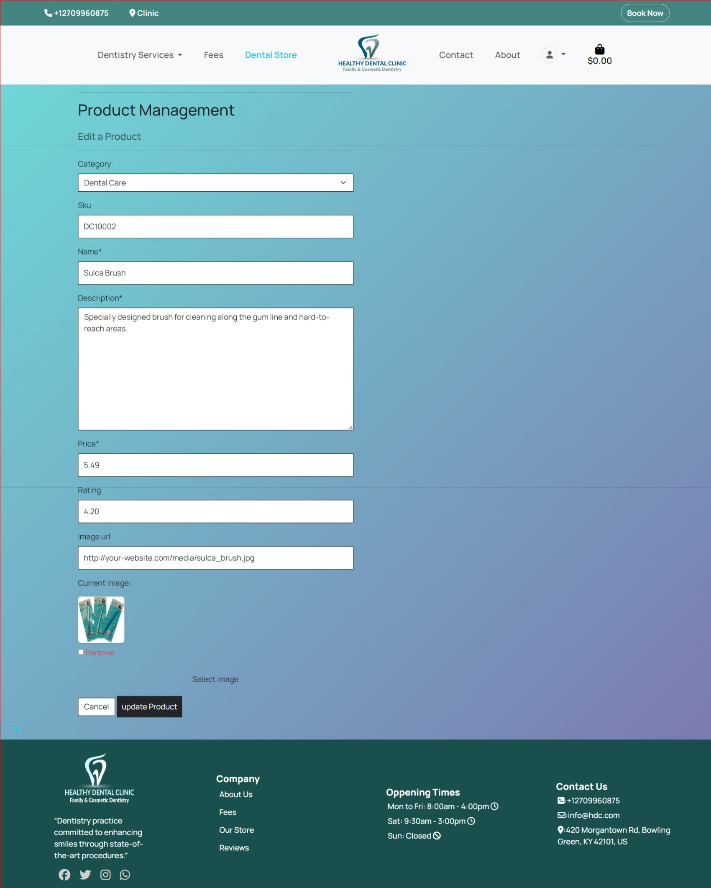

# Healthy Dental Clinic


## Introduction

Healthy Dental Clinic is a web application designed for a dental practice. It allows patients to book appointments, learn about services, and access a dental store and reviews. The project is built using:

* **Backend:** Python and Django
* **Frontend:** HTML, CSS, and JavaScript

While fully functional, this site primarily serves as an educational project to demonstrate web development skills.

Link to the deployed site can be found [Here](https://healthydentalclinic.herokuapp.com/)

## Showcase


### Strategy

* Healthy Dental Clinic aims to offer an easy-to-navigate online platform for patients to access dental services. Given the increasing demand for online healthcare services, this platform provides flexible and convenient options for booking appointments, accessing dental care information, and managing patient profiles.
* **Target Audience:** Individuals and families seeking dental care services.
* **Goals:** Provide a user-friendly platform for patients to:

  * Easily schedule appointments online.
  * Explore information about the clinic and its services.
  * Purchase dental hygiene products from the online store.

# UX

## User Stories

### As an Admin

* As an admin, I can manage users' accounts so that I can make any required changes to them if needed.
* As an admin, I can manage appointment schedules so that I can add, update, or delete appointments when necessary.
* As an admin, I can view created appointments so that I can fulfill the appointments or amend if needed.
* As an admin, I can delete any reviews so that I can remove them if they are no longer necessary.
* As an admin, I can view messages sent via the contact form so that I can act upon them promptly.
* As an admin, I can manage  content so that I can make amendments if needed.

### As a Site User

* As a site user, I can create or edit my account so that I can update my details accordingly.
* As a site user, I can log in to my account so that I can view my appointment history.
* As a site user, I can search for dental services so that I can find specific treatments.
* As a site user, I can sort dental services based on criteria such as price and category so that I can find the services I need.
* As a site user, I can browse through dental services so that I can decide what I may be interested in.
* As a site user, I can look at service details so that I can decide if I want to book an appointment.
* As a site user, I can easily book appointments online so that I can plan my visits conveniently.
* As a site user, I can view the contents of my booking basket so that I can make any adjustments before confirming.
* As a site user, I can update my booking by adding more or removing services so that I can decide on the number of services I intend to avail.
* As a site user, I can view my order summary so that I can verify it before confirming.
* As a site user, I can check out securely so that I can maintain the level of trust in the site.
* As a site user, I can view reviews posts so that I can  read.
* As a site user, I can comment on the reviews page so that I can express my opinion about appointment or shopping.
* As a site user, I can use the contact form so that I can contact the clinic.
* As a site user, I can sign up for the newsletter so that I can keep updated on the latest news and dental tips.

#### As a Patient (Site User)

* **Book Appointments:**
  * Easily book appointments online, selecting date, time, and service.
  * View available time slots.
  * Provide contact information and notes.
* **Learn About Services:**
  * Browse information about dental services.
  * See service details (descriptions, fees).
  * View dentist profiles and specializations.
  * View Reviews and post new one
* **Dental Store:**
  * Access the online store to purchase dental hygiene products.
  * Browse, add to cart, and securely checkout.
  * View order history and track orders.

#### As Admin User

* **Manage Appointments:**

  * View and manage upcoming appointments.
  * Update appointment statuses (confirm, complete, cancel).
  * Access patient information and notes.
* **Manage Products (Optional):**

  * Add, update, and delete products in the online store.

## Additional Features

* **User Accounts:** Manage appointments and order history.
* **Email Notifications:**  Confirmations for appointments and orders.
* **Online Presence:** Establish a strong online presence for the practice.
* **Convenience:** Provide easy access to services and information.
* **Engagement:** Engage patients with educational content and a user-friendly interface.

## Architecture

## Database

<details>
  <summary>Click here to view Database Schema:</summary>

  

</details>

## Design

Before I wrote any code for this site, I had to pin point a simple design of what I wanted my site to look like by using wireframes, not only for myself but as well of communicating what I wanted to achieve to my mentor.

<details>
  <summary>Click here to view Wireframes:</summary>

  
  
  
  
  

</details>

## Navigation

I went on to create a flowchart to help me visualize the website structure.

<details>
  <summary>Click here to view the navigation:</summary>

  
  

</details>

# Features

## Homepage

To start off, clicking the Healthy Dental Clinic URL takes you to the homepage with a logo on the left, my account and appointment booking options to the right, a search bar followed by a navigation menu and footer. All these appear on every page on the site. Also found on the homepage is a hero image accompanied by a hero text and a book now button beneath it.

### Header and Navigation


### The Home Page


### Register/Sign Up

On the right side of the homepage, for the first time user, they will need to register their account to enjoy most of the site benefits such as saving their appointment history, commenting on blogs. When registering users are asked for their username, email, and password.


### Sign In

Registered users would need to sign in when they visit the site again. They will be asked to enter their username and password. The Remember me option is also available making life easier for returning users. If users need to reset their password, a forgot password option is also available.


### Logout

Users can protect their account by logging out of the site.


### Service Detail

Each service page provides detailed information, including:

* **Description:**  A clear explanation of the service and its benefits.
* **Fees:**  Transparent pricing information for the service.
* **Appointment Booking:** A convenient link or button to book an appointment for that specific service.

<details>
  <summary>Click here to view different services pages:</summary>

  
  
  
  
  
  

</details>

### User Profile (for Logged-in Users)

* **Personal Information:** View and update contact details, shipping addresses, and other relevant information.
* **Appointment History:** View a list of upcoming and past appointments, with the option to reschedule or cancel.
* **Order History (if applicable):**  For users who have purchased items from the dental store, view their order history and track shipments.


### Fees Page

A comprehensive page listing all fees for the services offered by the clinic:

* **Categorized Fees:** Fees are organized by service category (general, cosmetic, restorative) for easy navigation.
* **Clear Pricing:** Transparent display of all associated costs.
  
  

### Admin Features (for Staff/Dentists)

* **Manage Appointments:**
  - View, update, and cancel appointments.
  - Access patient information and notes.

[Image of the admin appointment management interface]

* **Manage Products :**
  - Add, edit, and delete products in the dental store .




## Footer

The footer appears on all pages of the site and provides essential information and contact details:

* **Clinic Information:**

  * A brief description of the dental practice's commitment to quality care and modern dentistry.
  * Clinic logo to reinforce branding.
  * Social media links for Facebook, Twitter, Instagram, and WhatsApp.
* **Company Links:**

  * Quick links to key pages on the website, such as About Us, Fees, Our Store (if applicable), and Reviews.
    [Image of your footer's company links card]
* **Opening Times:**

  * Clearly displays the clinic's opening hours for each day of the week, including closed days.
* **Contact Information:**

  * Phone number for direct contact with the clinic.
  * Email address for inquiries.
  * Full physical address of the clinic.


## Reviews

The Reviews app allows users to share their experiences and feedback about the dental services they have received. This feature enhances user engagement and helps potential patients make informed decisions based on the experiences of others.

### Adding a Review

Users can easily add a review by filling out a form that includes their feedback and an optional image to accompany their review. This allows users to visually share their experience.


### Editing a Review

If users wish to update their feedback or change the accompanying image, they can edit their existing reviews. This ensures that the information remains relevant and accurate.


### Deleting a Review

Users have the option to delete their reviews if they no longer wish to share their feedback. This gives users control over their shared content.


### Viewing Reviews

All submitted reviews are displayed in a dedicated section, allowing users to read about others' experiences with the dental services. Reviews can be sorted by date or rating to help users find the most relevant feedback.


This feature helps create a transparent and interactive community around the dental practice, fostering trust and encouraging new patients to book appointments based on positive reviews from existing patients.

# 404 page

A 404 page is also available to handle navigation errors with a home link button to take them back to the home page


### Contact and About Pages

### Purpose

- **Contact Page:** Allows users to easily send messages or inquiries to the dental practice.
- **About Page:** Provides information about the dental practice and introduces the staff (dentists).

### Functionality

- **Contact Form:**
  - Presents a user-friendly form for entering their name, email, subject, and message.
  - Validates the form input to ensure data integrity.
  - Sends the message to the practice and stores it in the database.
  - Displays success or error messages based on the outcome of form submission.
- **About Us Display:**
  - Retrieves the list of dentists from the database.
  - Renders the `about.html` template, showcasing information about the practice and the dentists.

### Code Structure (contact app)

- **`views.py`:**
  - `contact(request)`: Function-based view that handles the contact form rendering, submission, and validation.
  - `AboutTemplateView`: Class-based view that renders the "About Us" page with dentist data.
- **`templates/contact/`:**
  - `contact.html`: Template for the contact form.
  - `about.html`: Template for displaying information about the practice and dentists.
- **`forms.py`:**
  - `ContactForm`: Defines the structure and validation rules for the contact form.
- **`models.py`:**
  - `Contact`: Model representing a contact message (name, email, subject, message).
- **`urls.py`:**
  - Defines URL patterns for the contact and about views.

### Example Usage

1. **Contact:**
   - Users visit the contact page and fill out the form.
   - Upon submission, they receive a success message if the message is sent successfully, or an error message if there's an issue.
2. **About Us:**
   - Users visit the About Us page to learn about the practice and the dentists on staff.

I hope this explanation is helpful! Let me know if you have any other questions or would like to add more details to your README.md.


### Dental store(All products)

Handled by products app ,all functions to view products ,manage products (CRUD ) related matter done in this app .

### Purpose

The Dental Store page provides a comprehensive view of all available dental products. Users can browse through the products, search for specific items, and add them to their shopping cart for purchase.

### Functionality

- **Product Listing:** Displays all dental products in an organized manner, potentially with categories, filtering, or sorting options.


- **Search:** Allows users to search for products by name, description, or other relevant attributes.
- **Product Details:** Each product has its own page with detailed information, including images, descriptions, and pricing.
- **Add to Cart:** Users can easily add desired products to their shopping cart from the product listing or detail pages.


- **Admin Product Management (CRUD):**
  - As an admin, you can add new products to the store using the `add_product` template.
  - You can edit existing product details using the `edit_product` template.
  - You can delete products from the store using the `product_confirm_delete` template to ensure safe removal.


**** Code Structure (products app)

- **`views.py`:**
  - Contains view functions/classes to render the product listing, search results, product detail pages, and handle add-to-cart actions.
  - Includes views for admin product management (create, read, update, delete).
- **`templates/products/`:**
  - `product_list.html`: Template for displaying the list of all products.
  - `product_detail.html`: Template for the individual product details.
  - `search_results.html`: Template for displaying search results.
  - (For Admin) `add_product.html`, `edit_product.html`, `product_confirm_delete.html`: Templates for managing products as an admin.
- **`models.py`:**
  - Defines the `Product` model to represent product data (name, description, price, images, etc.).
- **`urls.py`:**
  - Defines URL patterns for product views and admin actions.

### Example Usage

1. **User:**

   - **Browsing:** Navigate to the Dental Store page to see all products.
   - **Searching:** Use the search bar to find specific items.
   - **Viewing Details:** Click on a product to view more information.
   - **Adding to Cart:** Click the "Add to Cart" button on any product to add it to the basket.
2. **Admin:**

   - **Adding Products:** Use the admin interface to access the `add_product` form and fill in the details of new products.
   - **Editing Products:** Click the "Edit" button next to a product on the admin product list to access the `edit_product` form.
   - **Deleting Products:** Click the "Delete" button next to a product and confirm deletion on the `product_confirm_delete` page.

### Basket

The basket functionality allows users to add products to a temporary shopping cart before finalizing their purchase. It provides features to view the contents of the basket, update product quantities, and remove items.

    Renders the shopping basket contents.

    This view retrieves the basket data from the session, fetches the corresponding product
    details, and prepares the context to be displayed in the basket template.
    """
    # ... (code to retrieve bag items and prepare context) ...

    return render(request, 'basket/basket.html', context)


#### Basket icon

basket icon shown i all pages with items counts amount.


### Checkout

On the left side of the checkout, users provide their information, and on the right side is a summary of their order including the total and the delivery details.


Users have an option to save their information to a profile. Users will need to input their payment details. They still have an option to adjust the basket at this point by clicking the adjust basket button, or they can complete the order.

### Checkout Success

After completing an order, users receive an order confirmation with their details including an order number.


### Order Confirmation Email


## Technologies

### Languages

* [HTML](https://developer.mozilla.org/en-US/docs/Web/HTML)
* [CSS](https://developer.mozilla.org/en-US/docs/Web/CSS)
* [Javascript](https://www.javascript.com/)
* [Python](https://www.python.org/)

### Frameworks, programs and libraries used

* [Django](https://www.djangoproject.com/) - Django is a high-level Python web framework that encourages rapid development and clean, pragmatic design.
* [Bootstrap4](https://getbootstrap.com/) - A css framework
* [Gitpod](https://www.gitpod.io/) - Gitpod was used as an IDE
* [Github](https://github.com/) - I used Github to store all the data of my project after pushing it
* [Heroku](https://www.heroku.com/) - is a cloud platform service  I used to deploy and host the project
* [ElephantSQL](https://www.elephantsql.com/) - used as a database for the project
* [Font Awesome](https://fontawesome.com/) - Was used to add icons for my social media links.
* [PEP8ci](https://pep8ci.herokuapp.com/) - I used it to validate python code
* [Balsamiq](https://balsamiq.com/) - was used to draw wireframes
* [dbdiagram](https://dbdiagram.io/home) - was used to draw the database schema
* [Stripe](https://stripe.com/en-ie) - was used for checkout functionality and facilitate online payments
* [AWS](https://aws.amazon.com/s3/) - for  object storage through a web service interface.
* [Unsplash](https://unsplash.com/) - images used for the project
* [Pexels](https://www.pexels.com/) - images used for the project
* [Adobestock](https://stock.adobe.com/ie/) - images used for the project

# Testing

## Manual Testing

| Feature                     | Test                                                  | Expected Result                                                          | Actual Result |
| --------------------------- | ----------------------------------------------------- | ------------------------------------------------------------------------ | :-----------: |
| Logo                        | Clicking logo on homepage                             | Redirects user back to homepage                                          |     Pass     |
| Search                      | Using the search box                                  | Entering a search term returns relevant results                          |     Pass     |
| Search (No Results)         | Entering a search term with no matching products      | Displays a "No results found" message (and potentially related products) |     Pass     |
| Navigation Links            | Clicking navigation links                             | Directs user to corresponding pages                                      |     Pass     |
| Dental Store (All Products) | Clicking "All Products" link                          | Directs user to the page displaying all products                         |     Pass     |
| Back to Top                 | Clicking back-to-top arrow on product pages (if used) | Scrolls user back to the top of the page                                 |     Pass     |
| Sort By                     | Using the "Sort By" filter                            | Successfully sorts products by price, name, or category (if applicable)  |     Pass     |
| Shop Now Button             | Clicking "Shop Now" button (if used)                  | Directs user to the "All Products" page                                  |     Pass     |
| About Us                    | Clicking "About Us" link                              | Directs user to "About Us" page                                          |     Pass     |
| Privacy Policy              | Clicking "Privacy Policy" link                        | Directs user to privacy policy page                                      |     Pass     |
| Facebook Icon               | Clicking Facebook icon                                | Opens your Facebook page in a new tab/window                             |     Pass     |
| Contact                     | Clicking "Contact" link                               | Directs user to contact page                                             |     Pass     |
| Contact Form                | Submitting contact form                               | Successfully sends form data and displays a confirmation to user         |     Pass     |
| My Account (Admin)          | Accessing "My Account" as admin                       | Displays admin-specific dropdown menu with extra options                 |     Pass     |

## User story testing

### Admin

* As a admin I can manage users' accounts so that I can make any required changes to them if needed
  > Admin can manage user accounts from admin panels
  >
* As a admin I can manage products so that I can add , update or delete products when necessary
  > Admin can add, delete and update products on the site
  >
* As a admin I can view created orders so that I can full fill the orders or amend if needed
  > Admin can view orders in admin panel
  >
* As a user who place review ,I can delete any of comments i placed so that I can remove them if I nolonger feel they are still necessary or needed
  > admin specific user can delete comments
  >
* As a Admin I can view messages sent via contact form so that I can act upon them
  > Admin can view send messages in the admin panel
  >
* As an admin I can manage content so that I can make amendments if needed
  > Admin can add, edit or delete blogs via blog management. only accessible to admin
  >

## User Story Testing

### User

* As a site user, I can create or edit my account so that I can update my details accordingly.
    > A user can create an account using register and update their details on the profile page.
    >
* As a site user, I can log in to my account so that I can view my order history and appointments.
    > Logged-in users can view their order history and past appointments in their profile.
    >
* As a site user, I can search for products so that I can find specific items in the dental store.
    > Users can search for specific products using the search bar.
    >
* As a site user, I can sort products on criteria such as price and category so that I have a method of ordering the products.
    > Users can filter products by price or category to view them according to their preferences.
    >
* As a site user, I can browse through products so that I can decide what I may be interested in buying.
    > The site allows users to easily browse through all products to see what they might want to order.
    >
* As a site user, I can look at product details so that I can decide if I want to purchase it.
    > Each product has a detailed description so users can understand more about it.
    >
* As a site user, I can easily add products I want to purchase to a basket so that I can decide whether to purchase them or not.
    > Users can easily add products to their shopping bag.
    >
* As a site user, I can view the contents of my shopping basket so that I can make any adjustments.
    > Users can view the bag contents by clicking the bag icon.
    >
* As a site user, I can update my bag by adding more or removing products so that I can decide on the number of products I intend to buy.
    > Users can update the bag to adjust quantities or remove items entirely.
    >
* As a site user, I can view my order summary so that I can verify it before confirming.
    > From the secure checkout, users can verify their order summary before completing the purchase.
    >
* As a site user, I can checkout securely so that I can maintain trust in the site.
    > Users have a secure checkout process when completing a purchase.
    >
* As a site user, I can book appointments so that I can schedule visits to the clinic.
    > Users can book appointments online through the booking system.
    >
* As a site user, I can view clinic services and fees so that I can understand what services are offered and their costs.
    > Users can find detailed information about clinic services and fees on the services page.
    >
* As a site user, I can leave reviews for the services I have received so that I can share my experience with others.
    > Users can leave reviews on the review page and edit or delete them if needed.
    >
* As a site user, I can use the contact form so that I can contact the clinic for any inquiries.
    > By using the contact form, users can send messages to the clinic.
    >
* As a site user, I can sign up for the newsletter so that I can keep updated on the latest news and offers.
    > Users can easily sign up for the newsletter to receive the latest news and offers.
    >

## Functionality testing

Throughout developing this site, I have been using Chrome, and chrome dev tools to help with debugging issues. Testing responsiveness was done using chrome emulated devices.

## Compatibility testing

Chrome emulated devices, and hardware devices iphone 13 pro, pixel 7 , ipad mini and ipad air were used to test compatibility


## JavaScript Enhancements

The following JavaScript code is used to add interactivity and visual effects to various elements of the website, primarily the homepage:

```javascript

<script>

    // Back-to-Top Button
    $('.btt-link').click(function(e){
        window.scrollTo(0,0);  // Smooth scroll to the top of the page
    });
    
    // Toast Messages (using Bootstrap)
    $(document).ready(function() {
        
            $('.toast').toast('show'); // Display any Django messages as toasts
        
    });


    // Fade-in Effect for Images
    window.addEventListener('load', function() {
        const fadeInImages = document.querySelectorAll('.fade-in-image'); // Select images with this class

        function checkImageVisibility() {
            fadeInImages.forEach((image) => {
                // ... (checks if image is in viewport and adds/removes 'in-view' class accordingly) ...
            });
        }

        window.addEventListener('scroll', checkImageVisibility); 
        checkImageVisibility(); // Trigger initially on page load
    });


    // Show Active Dropdown Link (commented out)
    // This code was likely intended to mark dropdown links as active based on the current page, but it's commented out.

    // Fade-in Reviews on Scroll
    window.addEventListener('scroll', function() {
        const reviewsSection = document.querySelector('.reviews'); // Select reviews section
        const cards = reviewsSection.querySelectorAll('.review-card');

        // ... (calculates if reviews section is visible and adjusts opacity of review cards) ...
    });
    
    // Slide-in Company Logos (commented out)
    // This section was intended to add a slide-in animation to company logos when they become visible, but it's commented out.
</script>

```

**Explanation of Key Features:**

- **Back-to-Top Button:** When the `.btt-link` element is clicked, the page smoothly scrolls to the top.
- **Toast Messages:** Django messages (success, error, info ,warning.) are displayed as Bootstrap toasts.


- **Image Fade-in:** Images with the `.fade-in-image` class gradually fade into view as they enter the viewport.
- **Active Dropdown Link (Commented Out):** This code would have highlighted the currently active dropdown link in the navigation menu, but it's currently disabled.
- **Reviews Fade-in:** Reviews within the `.reviews` section fade in as the user scrolls down to them.
- **Slide-in Company Logos (Commented Out):** This section was intended to add a slide-in animation to company logos as they come into view, but it's currently inactive.

**Additional Notes:**

- **jQuery Dependency:** This code relies on jQuery (`$`) for DOM manipulation and event handling.
- **Commented-Out Sections:** The two commented-out sections provide hints about additional features you might have been working on, but they are not currently implemented.

Please let me know if you have any other questions. 

and other js has been tested and 
I used JSlint to validate javascript found in some apps
### Javascript validation

I used JSlint to validate javascript found in some apps

* basket app - semi colon warning
* base.html - zero warnings
* pay - 8 warnings but the code is directly from mailchimp
* checkout - semi colon warnings
* products - semi colon warnings
* profiles - no warnings
* appointements - no warning
* contact - label was wrong

### Html validation 

I used Htmlvalidato [ html validation ](https://validator.w3.org/#validate_by_input)  to find about any wrong tags and errors
first i had about 20 errors , so by find out about it in source code(genrated page by django)
then i overcome those and at the end i got this for all pages


### Css validation 
I used Css validator [ css validation ](https://jigsaw.w3.org/css-validator/#validate_by_input) site to find about any wrong tags and errors
first i had about 5 errors , so by find out about it in source code(genrated page by django)
then i modified errors .that is the result


### Python

[ CI Python linter ](https://pep8ci.herokuapp.com/) was used to test python code

## Bugs

For this project there were so many bugs I encountered from the beginning though some were minor. Some of them I ended up taking them to tutor support whom have been very helpful.

### Bug 1

Toasts not showing/displaying - Having all the code set up properly and checking in chrome dev tools I could see they were rendering in my template however not displaying. To fix this (from tutor support), There is a script in base.html to show any toasts in postloadjs and in the template I wanted them to show up I had a  without {{ block.super }} in it. This resulted in the block from base.html being overwritten by a blank block. Removing the blank block in the detail template fixed it.

### Bug 2

In testing my search box and product management - error handling was not working each time I was testing the search box and product management whereby the error toast was rendering but not display , also the header would just disappear. The fix was simple though it took me hours, I searched via Code Institute slack and found out someone made my mistake as well of missing out a closing div tag in toast error.


### Bug 3

I had errors in validating html and to resolve them I had to put ul tags in mobile header which led to the bug below. To fix this I added padding to icons(search, my account, bag)


### Bug 4

Double orders in admin panel


Solution: In checkout views.py in the checkout function, 2 following lines of code fixed it


### Bug 5

Contact form resubmission on page refresh. To fix this according to [the solution from stack overflow](https://stackoverflow.com/questions/5823580/django-form-resubmitted-upon-refresh)
I needed to use a return HttpResponseRedirect,which I added to my view after the form is submitted.

### Bug 6

Anonymous user not iterable error whereby users not logged in could receive error when checking out, they would not receive a payment confirmation yet the order would have been created behind the scenes. To fix- In checkout success function in views.py I added an if statement to check if user is aunthenticated:(  if request.user.is_authenticated) and attach the profile to user.


# Deployment

I developed this site local vs code, using git for version control. Then deployed to Heroku using the following steps

* Log in to [Heroku](https://id.heroku.com/login) or create an account
* Click New and Create New App
* I selected Europe as region.
* Click Create App button

I then went to create a database to connect to the new created app.

* Login to [ElephantSQL](https://www.elephantsql.com/)
* Create new instance
* Set up your plan - Give the plan a name and select Tiny Turtle free plan
* Select region button
* Select a data center ner your. I selected EU-West-1(Ireland)
* Click Review
* Click Create instance
* Return to elephantsql dashboard, click on database instance name
* In the url section, clicking the copy icon will copy the database url to the clipboard
* Go back to Heroku to your created app, go to Settings
* Add config var DATABASE-URL, and for the value, copy in your databse url from ElephantSQL. do not add quotation marks around your database
* In Gitpod install dj-database_url and psycopg2 to connect to your external database
* Update requirements.txt: pip freeze > requirements
* import dj_database_url in settings and update your database
* migrate your database
* create a new superuser for your database and at this point your database is exposed do not commit it to github
* Install gunicorn and freeze into the requirements file
* Then create Procfile
* DISABLE_COLLECTSTATIC
* Commit and push to github
* On your app in Heroku go to Deploy and connect it to github and search your repository, click connect.
* Choose automatic or manual deploy. I chose manual. Click deploy branch
* When complete click View to open the deployed app

## From Github docs

### Forking

* Open GitHub page that hosts the repository you wish to fork.
* Find the 'Fork' button at the top right of the page
* Once you click the button the fork will be in your repository

### Cloning

* Open Go to the repository page on Github
* click on the green button that says "Code".
* You can choose to download a zip file of the repository, unpack it on your local machine, and open it in your IDE.
* Copy the URL under the HTTPS tab to clone using https.
* In a new window, and set the current directory to the one you want to contain the clone from.
* Type git clone and paste the URL copied from the GitHub page.
* The repository clone will now be created on your machine.

## Credits

* Images are from [Unsplash](https://unsplash.com/s/photos/home-organization), [Adobestock](https://stock.adobe.com/ie/), [Pexels](https://www.pexels.com/)
* Code Institute Botique Ado walk through
* Hello django code institute
* [Dataflair django tutorial](https://data-flair.training/blogs/django-tutorials-home/)
* [Stack overflow](https://stackoverflow.com/)

Products description inspiration from

* [The neat system](https://www.theneatsystem.co.za/)
* [Amazon](https://www.amazon.co.uk/)
* [Ikea](https://www.ikea.com)

### Acknowledgement and support

* This whole chapter took me months to complete  due to circumstances beyond control. Despite all this I would love to extend my gratitude to Code institute and their amazing team.  The tutor support for this project in particular, Ed, Ger you guys did a superb job.
* My Mentor Jubril sharp,straight and honest feedback

