# Healthy Dental Clinic


## Introduction

Healthy Dental Clinic is a web application designed for a dental practice. It allows patients to book appointments, learn about services, and access a dental store and reviews. The project is built using:

* **Backend:** Python and Django
* **Frontend:** HTML, CSS, and JavaScript

While fully functional, this site primarily serves as an educational project to demonstrate web development skills.

## Showcase

[Image of your dental practice home page]

### Strategy

* **Target Audience:** Individuals and families seeking dental care services.
* **Goals:** Provide a user-friendly platform for patients to:
  * Easily schedule appointments online.
  * Explore information about the clinic and its services.
  * Purchase dental hygiene products from the online store.

## UX (User Experience)

### User Stories

#### As a Patient (Site User)

* **Book Appointments:**
  * Easily book appointments online, selecting date, time, and service.
  * View available time slots.
  * Provide contact information and notes.
* **Learn About Services:**
  * Browse information about dental services.
  * See service details (descriptions, fees).
  * View dentist profiles and specializations.
  * View Reviews and post new one
* **Dental Store:**
  * Access the online store to purchase dental hygiene products.
  * Browse, add to cart, and securely checkout.
  * View order history and track orders.

#### As Admin User

* **Manage Appointments:**

  * View and manage upcoming appointments.
  * Update appointment statuses (confirm, complete, cancel).
  * Access patient information and notes.
* **Manage Products (Optional):**

  * Add, update, and delete products in the online store.

## Additional Features

* **User Accounts:** Manage appointments and order history.
* **Email Notifications:**  Confirmations for appointments and orders.

### Strategy

* **Online Presence:** Establish a strong online presence for the practice.
* **Convenience:** Provide easy access to services and information.
* **Engagement:** Engage patients with educational content and a user-friendly interface.

## Architecture

### Database

<details>
<summary>Click here to view Database Schema:</summary>

[Image of your dental clinic database schema]

</details>

## Design

Before writing any code for the site, I created wireframes to visualize the design and communicate my goals to mentors.

<details>
<summary>Click here to view Wireframes:</summary>


 
  
  
  

</details>

## Navigation

I created a flowchart to visualize the website structure.

<details>
<summary>Click here to view the navigation:</summary>

  
  

</details>

## Project Type

Healthy Dental Clinic is a web application designed to support the online presence of a dental practice. The functionality on this site for a patient is the ability to book appointments, learn about services, and purchase dental products conveniently. For the clinic staff, the goal is to manage appointments, patient information, and potentially the online store inventory.

## Features

### Homepage

The homepage welcomes patients with a logo, navigation menu, and a hero section highlighting the clinic's mission and services. It features:

* **Header and Navigation:**
  
* **Hero Section:**
  
* **Call to Action:** Clear buttons or links to encourage appointment booking or exploring services.

### Appointment Booking

The appointment booking page allows patients to easily schedule appointments:


* **User Authentication:**
* **Registration:**
  

  - New users can sign up for an account.
  - Existing users can log in.
  - Authentication is handled securely using Django Allauth.
* **Login/Registration:**
  

  - New users can register for an account to manage appointments and view their order history.
  - Existing users can log in securely using their email and password.
  - The authentication process is handled by Django Allauth, providing a robust and secure framework.
* **Logout:**
  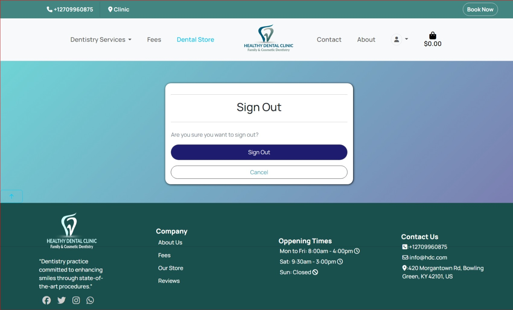

  - Authenticated users can easily log out to protect their account information.

### Booking Appointments

* **By User Authentication :**

  -by creating an account allows users to manage their appointments more effectively and access additional features.
* **Booking Form:**

  - User-friendly form to select the service,  (if applicable), date, and time.
  - Form validation ensures correct data entry.
* **Success Page:**

  - Confirms the booked appointment.
  - Optionally includes a QR code or other reference for the appointment.
    

## Dentistry Services

The navigation bar provides easy access to all the dental services offered by the clinic.

### Service Detail

Each service page provides detailed information, including:

* **Description:**  A clear explanation of the service and its benefits.
* **Fees:**  Transparent pricing information for the service.
* **Appointment Booking:** A convenient link or button to book an appointment for that specific service.

<details>
  <summary>Click here to view different services pages:</summary>

  
  
  
  
  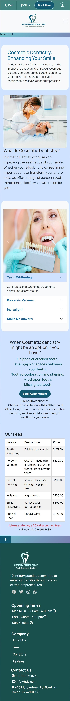
  

</details>

### User Profile (for Logged-in Users)

* **Personal Information:** View and update contact details, shipping addresses, and other relevant information.
* **Appointment History:** View a list of upcoming and past appointments, with the option to reschedule or cancel.
* **Order History (if applicable):**  For users who have purchased items from the dental store, view their order history and track shipments.

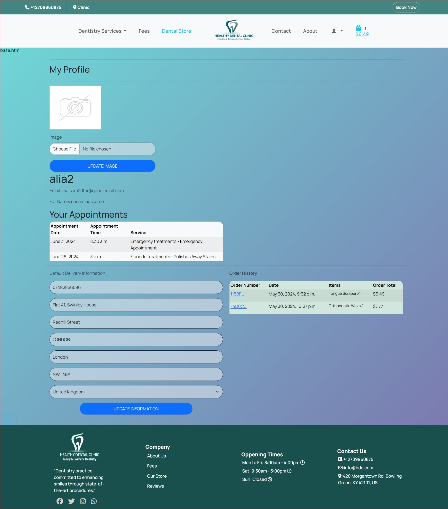
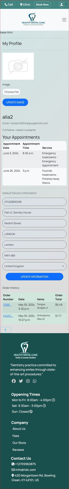

### Fees Page

A comprehensive page listing all fees for the services offered by the clinic:

* **Categorized Fees:** Fees are organized by service category (general, cosmetic, restorative) for easy navigation.
* **Clear Pricing:** Transparent display of all associated costs.

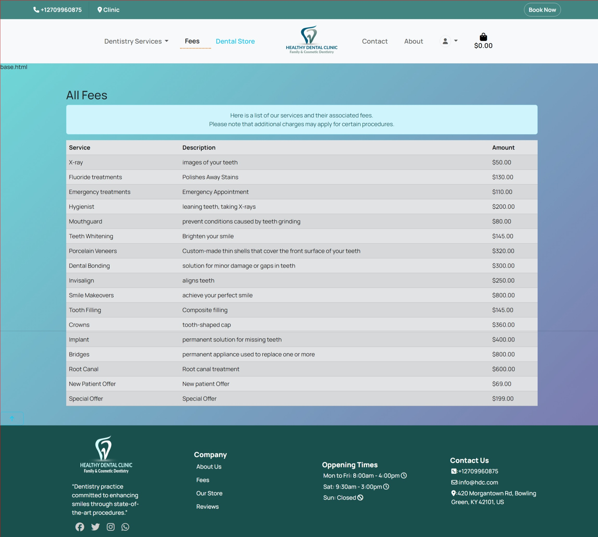


### Admin Features (for Staff/Dentists)

* **Manage Appointments:**
  - View, update, and cancel appointments.
  - Access patient information and notes.

[Image of the admin appointment management interface]

* **Manage Products :**
  - Add, edit, and delete products in the dental store .

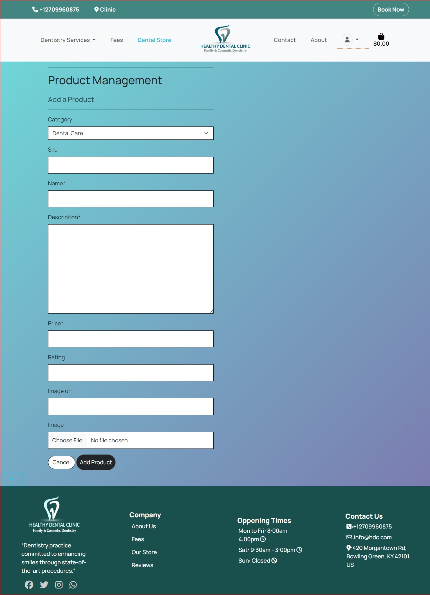


## Footer

The footer appears on all pages of the site and provides essential information and contact details:

* **Clinic Information:**

  * A brief description of the dental practice's commitment to quality care and modern dentistry.
  * Clinic logo to reinforce branding.
  * Social media links for Facebook, Twitter, Instagram, and WhatsApp.
* **Company Links:**

  * Quick links to key pages on the website, such as About Us, Fees, Our Store (if applicable), and Reviews.
   
* **Opening Times:**

  * Clearly displays the clinic's opening hours for each day of the week, including closed days.
* **Contact Information:**

  * Phone number for direct contact with the clinic.
  * Email address for inquiries.
  * Full physical address of the clinic.


## Reviews

The Reviews app allows users to share their experiences and feedback about the dental services they have received. This feature enhances user engagement and helps potential patients make informed decisions based on the experiences of others.

### Adding a Review

Users can easily add a review by filling out a form that includes their feedback and an optional image to accompany their review. This allows users to visually share their experience.


### Editing a Review

If users wish to update their feedback or change the accompanying image, they can edit their existing reviews. This ensures that the information remains relevant and accurate.


### Deleting a Review

Users have the option to delete their reviews if they no longer wish to share their feedback. This gives users control over their shared content.


### Viewing Reviews

All submitted reviews are displayed in a dedicated section, allowing users to read about others' experiences with the dental services. Reviews can be sorted by date or rating to help users find the most relevant feedback.


This feature helps create a transparent and interactive community around the dental practice, fostering trust and encouraging new patients to book appointments based on positive reviews from existing patients.


# 404 page

A 404 page is also available to handle navigation errors with a home link button to take them back to the home page


### Contact and About Pages

### Purpose

- **Contact Page:** Allows users to easily send messages or inquiries to the dental practice.
- **About Page:** Provides information about the dental practice and introduces the staff (dentists).

### Functionality

- **Contact Form:**
    - Presents a user-friendly form for entering their name, email, subject, and message.
    - Validates the form input to ensure data integrity.
    - Sends the message to the practice and stores it in the database.
    - Displays success or error messages based on the outcome of form submission.
- **About Us Display:**
    - Retrieves the list of dentists from the database.
    - Renders the `about.html` template, showcasing information about the practice and the dentists.

### Code Structure (contact app)

- **`views.py`:**
    - `contact(request)`: Function-based view that handles the contact form rendering, submission, and validation.
    - `AboutTemplateView`: Class-based view that renders the "About Us" page with dentist data.
- **`templates/contact/`:**
    - `contact.html`: Template for the contact form.
    - `about.html`: Template for displaying information about the practice and dentists.
- **`forms.py`:**
    - `ContactForm`: Defines the structure and validation rules for the contact form.
- **`models.py`:**
    - `Contact`: Model representing a contact message (name, email, subject, message).
- **`urls.py`:**
    - Defines URL patterns for the contact and about views.

### Example Usage

1. **Contact:**
    - Users visit the contact page and fill out the form.
    - Upon submission, they receive a success message if the message is sent successfully, or an error message if there's an issue.
2. **About Us:**
    - Users visit the About Us page to learn about the practice and the dentists on staff.

I hope this explanation is helpful! Let me know if you have any other questions or would like to add more details to your README.md.


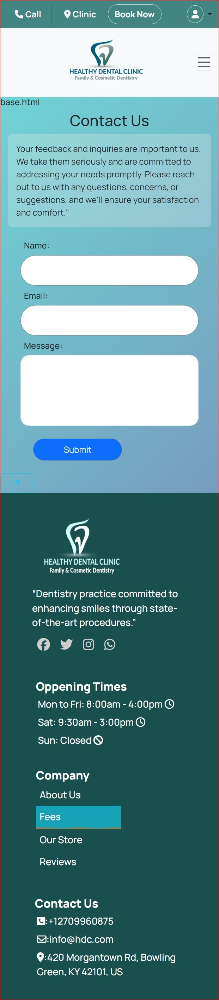
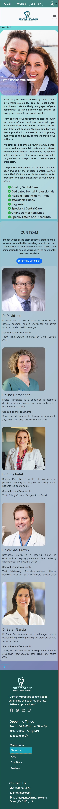


### Dental store(All products)

Handled by products app ,all functions to view products ,manage products (CRUD ) related matter done in this app .


### Purpose

The Dental Store page provides a comprehensive view of all available dental products. Users can browse through the products, search for specific items, and add them to their shopping cart for purchase.

### Functionality

- **Product Listing:** Displays all dental products in an organized manner, potentially with categories, filtering, or sorting options.

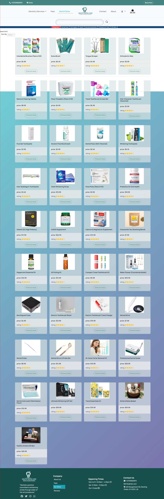


- **Search:** Allows users to search for products by name, description, or other relevant attributes.
- **Product Details:** Each product has its own page with detailed information, including images, descriptions, and pricing.
- **Add to Cart:** Users can easily add desired products to their shopping cart from the product listing or detail pages.


- **Admin Product Management (CRUD):**
    - As an admin, you can add new products to the store using the `add_product` template.
    - You can edit existing product details using the `edit_product` template.
    - You can delete products from the store using the `product_confirm_delete` template to ensure safe removal.


**** Code Structure (products app)

- **`views.py`:**
    - Contains view functions/classes to render the product listing, search results, product detail pages, and handle add-to-cart actions.
    - Includes views for admin product management (create, read, update, delete).
- **`templates/products/`:**
    - `product_list.html`: Template for displaying the list of all products.
    - `product_detail.html`: Template for the individual product details.
    - `search_results.html`: Template for displaying search results.
    - (For Admin) `add_product.html`, `edit_product.html`, `product_confirm_delete.html`: Templates for managing products as an admin.
- **`models.py`:**
    - Defines the `Product` model to represent product data (name, description, price, images, etc.).
- **`urls.py`:**
    - Defines URL patterns for product views and admin actions.

### Example Usage

1. **User:**
   - **Browsing:** Navigate to the Dental Store page to see all products.
   - **Searching:** Use the search bar to find specific items.
   - **Viewing Details:** Click on a product to view more information.
   - **Adding to Cart:** Click the "Add to Cart" button on any product to add it to the basket.

2. **Admin:**
   - **Adding Products:** Use the admin interface to access the `add_product` form and fill in the details of new products.
   - **Editing Products:** Click the "Edit" button next to a product on the admin product list to access the `edit_product` form.
   - **Deleting Products:** Click the "Delete" button next to a product and confirm deletion on the `product_confirm_delete` page.
 


### Basket


The basket functionality allows users to add products to a temporary shopping cart before finalizing their purchase. It provides features to view the contents of the basket, update product quantities, and remove items.

### Code Structure

The basket functionality is primarily implemented in the `basket` app, which contains the following files:

- **`views.py`:**  This file defines the views responsible for rendering the basket page, adding/updating items, and handling checkout-related data.
- **`templates/basket/basket.html`:** This template is used to render the basket page, displaying the items added by the user.
- **`urls.py`:** (Optional) This file defines URL patterns for the basket views.
- **`models.py`:** (Optional) You might have a model to represent basket items (if you're not storing the basket data in the session).

    """
    Renders the shopping basket contents.

    This view retrieves the basket data from the session, fetches the corresponding product 
    details, and prepares the context to be displayed in the basket template.
    """
    # ... (code to retrieve bag items and prepare context) ...

    return render(request, 'basket/basket.html', context)


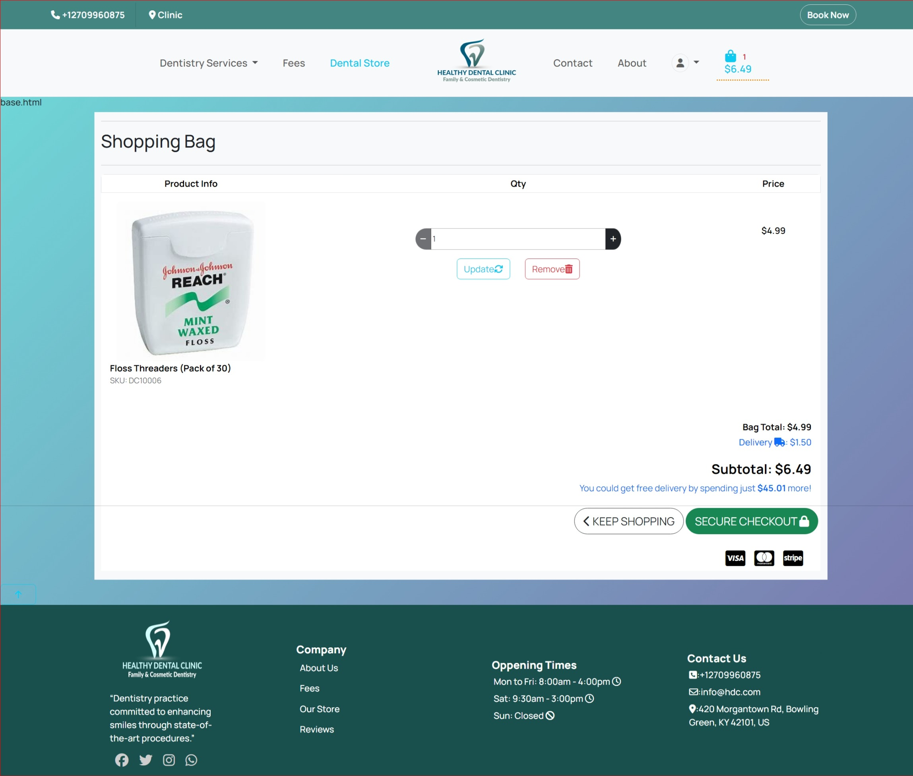
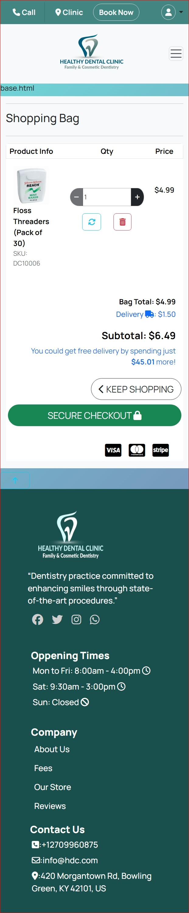


#### Basket icon

basket icon shown i all pages with items counts amount.


### Checkout

On the left side of the checkout, users provide their information, and on the right side is a summary of their order including the total and the delivery details.


Users have an option to save their information to a profile. Users will need to input their payment details. They still have an option to adjust the basket at this point by clicking the adjust basket button, or they can complete the order.


### Checkout Success

After completing an order, users receive an order confirmation with their details including an order number.


### Order Confirmation Email


## Technologies

### Languages

* [HTML](https://developer.mozilla.org/en-US/docs/Web/HTML)
* [CSS](https://developer.mozilla.org/en-US/docs/Web/CSS)
* [Javascript](https://www.javascript.com/)
* [Python](https://www.python.org/)

### Frameworks, programs and libraries used

* [Django](https://www.djangoproject.com/) - Django is a high-level Python web framework that encourages rapid development and clean, pragmatic design.
* [Bootstrap4](https://getbootstrap.com/) - A css framework
* [Gitpod](https://www.gitpod.io/) - Gitpod was used as an IDE
* [Github](https://github.com/) - I used Github to store all the data of my project after pushing it
* [Heroku](https://www.heroku.com/) - is a cloud platform service  I used to deploy and host the project
* [ElephantSQL](https://www.elephantsql.com/) - used as a database for the project
* [Font Awesome](https://fontawesome.com/) - Was used to add icons for my social media links.
* [PEP8ci](https://pep8ci.herokuapp.com/) - I used it to validate python code
* [Balsamiq](https://balsamiq.com/) - was used to draw wireframes
* [dbdiagram](https://dbdiagram.io/home) - was used to draw the database schema
* [Stripe](https://stripe.com/en-ie) - was used for checkout functionality and facilitate online payments
* [AWS](https://aws.amazon.com/s3/) - for  object storage through a web service interface.
* [Unsplash](https://unsplash.com/) - images used for the project
* [Pexels](https://www.pexels.com/) - images used for the project
* [Adobestock](https://stock.adobe.com/ie/) - images used for the project

# Testing

## Manual Testing

| Feature                    | Test                                                 | Expected Result                                                         | Actual Result |
| -------------------------- | ---------------------------------------------------- | ----------------------------------------------------------------------- | :-----------: |
| Logo                       | Clicking logo on homepage                            | Redirects user back to homepage                                         |     Pass      |
| Search                     | Using the search box                                 | Entering a search term returns relevant results                         |     Pass      |
| Search (No Results)        | Entering a search term with no matching products     | Displays a "No results found" message and potentially related products  |     Pass      |
| Navigation Links           | Clicking navigation links                            | Directs user to corresponding pages                                     |     Pass      |
| Dental store (All Products)| Clicking "All Products" link                         | Directs user to page displaying all products                            |     Pass      |
| Back to Top                | Clicking back-to-top arrow on product pages (if used)| Scrolls user back to the top of the page                                |     Pass      |
| Sort By                    | Using the "Sort By" filter                           | Successfully sorts products by price, name, or category (if applicable) |     Pass      |
| Shop Now Button            | Clicking "Shop Now" button (if used)                 | Directs user to the "All Products" page                                 |     Pass      |
| About Us                   | Clicking "About Us" link                             | Directs user to "About Us" page                                         |     Pass      |
| Privacy Policy             | Clicking "Privacy Policy" link                       | Directs user to privacy policy page                                     |     Pass      |
| Facebook Icon              | Clicking Facebook icon                               | Opens your Facebook page in a new tab/window                            |     Pass      |
| Contact                    | Clicking "Contact" link                              | Directs user to contact page                                            |     Pass      |
| Contact Form               | Submitting contact form                              | Successfully sends form data and displays confirmation to user          |     Pass      |
| My Account (Admin)         | Accessing "My Account" as admin                      | Displays admin-specific dropdown menu with extra options                |     Pass      |
| Contact                    | Selecting Contact                                    | Directs user to contact page                                            |     Pass      |
| Contact Form Submission    | Submitting contact form                              | Successfully sends submitted form and can be seen in admin              |     Pass      |
| My Account                 | Selecting my account as admin                        | Displays dropdown menu unique to admin apart from profile and logout    |     Pass      |

## User Story Testing (Admin)

* **As an admin, I can manage users' accounts so that I can make any required changes to them if needed.**

  > Admin can view, edit, and delete user accounts from the admin panel.
  >
* **As an admin, I can manage products so that I can add, update, or delete products when necessary.**

  > Admin can add, edit, and delete products on the site through the admin panel.
  >
* **As an admin, I can view created orders so that I can fulfill them or make amendments if needed.**

  > Admin can view and manage orders in the admin panel.
  >
* **As an admin, I can view messages sent via the contact form so that I can act upon them.**

  > Admin can view and respond to messages in the admin panel.
  >

## User Story Testing

### User

* **As a site user, I can create or edit my account so that I can manage my information and appointments.**

  > - Users can create accounts and update their details through the registration and profile pages.
  > - Users can view and manage upcoming and past appointments.
  >
* **As a site user, I can log into my account so that I can view my order history and appointments.**

  > - Logged-in users have access to their complete order and appointment history.
  >
* **As a site user, I can search for services and products so that I can find what I need.**

  > - A search bar is available for users to quickly locate specific services, products, or information.
  >
* **As a site user, I can browse services and fees so that I can understand what the clinic offers and the associated costs.**

  > - Clear and detailed information about services and their fees is presented on the website.
  >
* **As a site user, I can book appointments online so that I can schedule visits at my convenience.**

  > - An intuitive appointment booking system allows users to choose dates and times.
  >
* **As a site user, I can browse and purchase products from the dental store.**

  > - The online store provides a user-friendly interface for browsing and selecting products.
  >
* **As a site user, I can view product details so that I can make informed purchase decisions.**

  > - Each product page includes comprehensive descriptions and relevant information.
  >
* **As a site user, I can add products to a cart and manage its contents.**

  > - Users can easily add or remove items from their cart and adjust quantities.
  >
* **As a site user, I can securely checkout and complete my purchase.**

  > - A secure checkout process ensures user data protection and transaction safety.
  >
* **As a site user, I can leave reviews about my experience with the clinic or its products.**

  > - A review system allows users to share their feedback and experiences.
  >
* **As a site user, I can edit my reviews if I need to update or correct them.**

  > - Users have the option to edit their previously submitted reviews.
  >
* **As a site user, I can contact the dental practice through a contact form.**

  > - A contact form facilitates communication between users and the dental practice.
  >
* **As a site user, I can sign up for a newsletter to stay informed about the latest news and offers.**

  > - A newsletter signup option keeps users informed about relevant updates.
  >

## Functionality testing

Throughout developing this site, I have been using Chrome, and chrome dev tools to help with debugging issues. Testing responsiveness was done using chrome emulated devices.

## Compatibility testing

Chrome emulated devices, and hardware devices iphone 13 pro, pixel 7 , ipad mini and ipad air were used to test compatibility

## Wave testing

I also tested this site on [WAVE Web Accessibility Evaluation Tool](https://wave.webaim.org/) is a set of evaluation tools which helps authors to make their web content more accessible to individuals with disabilities. WAVE can identify many accessibility and Web Content Accessibility Guideline (WCAG) errors, but also facilitates human evaluation of web content as per definition on their site.

<details>
  <summary>Home</summary>

  


  Absolutely! Here's the explanation of the JavaScript code, written in the README.md markdown format:

## Html Validator 
All pages tested and sorted by checking pages on 
[html validator ](https://validator.w3.org/nu/#textarea) tried my best 
to remove errors .finaly i did and got this nicely message.


## JavaScript Enhancements

The following JavaScript code is used to add interactivity and visual effects to various elements of the website, primarily the homepage:

```javascript

<script>

    // Back-to-Top Button
    $('.btt-link').click(function(e){
        window.scrollTo(0,0);  // Smooth scroll to the top of the page
    });
    
    // Toast Messages (using Bootstrap)
    $(document).ready(function() {
        
            $('.toast').toast('show'); // Display any Django messages as toasts
        
    });


    // Fade-in Effect for Images
    window.addEventListener('load', function() {
        const fadeInImages = document.querySelectorAll('.fade-in-image'); // Select images with this class

        function checkImageVisibility() {
            fadeInImages.forEach((image) => {
                // ... (checks if image is in viewport and adds/removes 'in-view' class accordingly) ...
            });
        }

        window.addEventListener('scroll', checkImageVisibility); 
        checkImageVisibility(); // Trigger initially on page load
    });


    // Show Active Dropdown Link (commented out)
    // This code was likely intended to mark dropdown links as active based on the current page, but it's commented out.

    // Fade-in Reviews on Scroll
    window.addEventListener('scroll', function() {
        const reviewsSection = document.querySelector('.reviews'); // Select reviews section
        const cards = reviewsSection.querySelectorAll('.review-card');

        // ... (calculates if reviews section is visible and adjusts opacity of review cards) ...
    });
    
    // Slide-in Company Logos (commented out)
    // This section was intended to add a slide-in animation to company logos when they become visible, but it's commented out.
</script>

```

**Explanation of Key Features:**

- **Back-to-Top Button:** When the `.btt-link` element is clicked, the page smoothly scrolls to the top.
- **Toast Messages:** Django messages (success, error, etc.) are displayed as Bootstrap toasts.
- **Image Fade-in:** Images with the `.fade-in-image` class gradually fade into view as they enter the viewport.
- **Active Dropdown Link (Commented Out):** This code would have highlighted the currently active dropdown link in the navigation menu, but it's currently disabled.
- **Reviews Fade-in:** Reviews within the `.reviews` section fade in as the user scrolls down to them.
- **Slide-in Company Logos (Commented Out):** This section was intended to add a slide-in animation to company logos as they come into view, but it's currently inactive.

**Additional Notes:**

- **jQuery Dependency:** This code relies on jQuery (`$`) for DOM manipulation and event handling.
- **Commented-Out Sections:** The two commented-out sections provide hints about additional features you might have been working on, but they are not currently implemented.

Please let me know if you have any other questions. 

and other js has been tested and 
I used JSlint to validate javascript found in some apps

* basket app - semi colon warning
* base.html - zero warnings
* newsletter - 8 warnings but the code is directly from mailchimp
* checkout - semi colon warnings
* products - semi colon warnings
* profiles - no warnings

### Python

[ CI Python linter ](https://pep8ci.herokuapp.com/) was used to test python code


# Deployment

I developed this site on Gitpod, using git for version control. Then deployed to Heroku using the following steps
